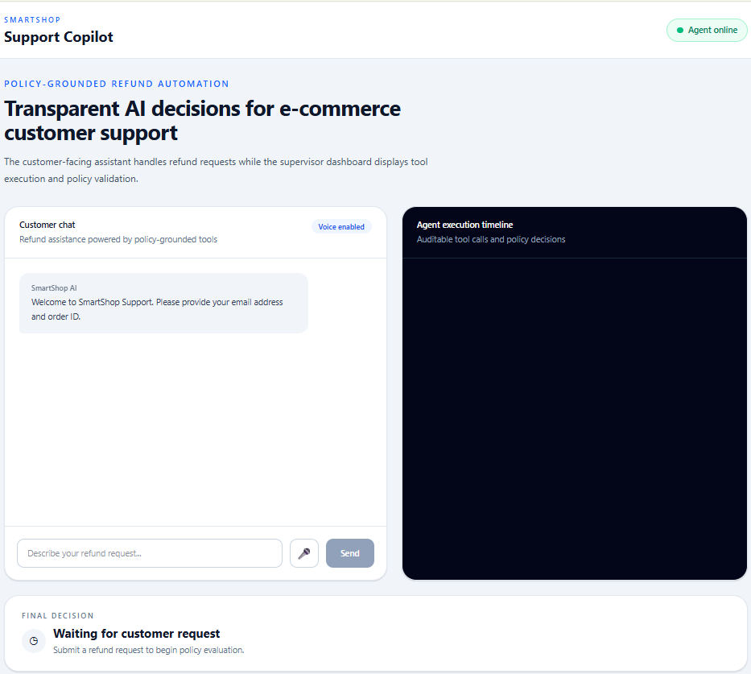
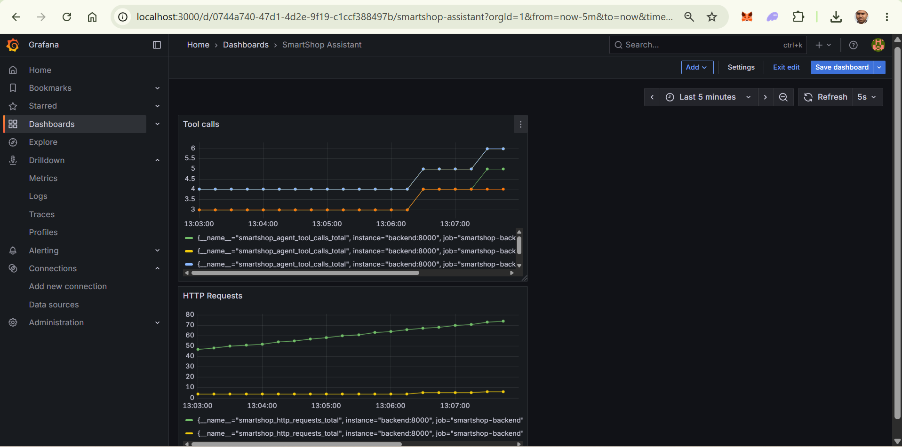

# 🛍️ SmartShop Support Copilot

### Enterprise AI Customer Support Agent powered by LangGraph

> Production-style AI customer support platform with deterministic
> refund policy enforcement, voice interaction, observability, Docker
> deployment, and CI/CD.

------------------------------------------------------------------------

## 🚀 Highlights

-   🤖 LangGraph workflow orchestration
-   🧰 OpenAI tool calling with deterministic business rules
-   🗄️ SQLite CRM using SQLAlchemy Repository Pattern
-   🎤 Voice-enabled customer support (speech recognition + speech
    synthesis)
-   🐳 Docker & Docker Compose deployment
-   ✅ GitHub Actions CI
-   📊 Prometheus + Grafana observability
-   🧪 Automated API and policy tests

------------------------------------------------------------------------

## 🏗️ Architecture

                    Browser
                        │
                        ▼
             React + TypeScript
                        │
             Text / Voice Input
                        │
                        ▼
                  FastAPI API
                        │
          Request Logging Middleware
          • Request ID
          • Structured Logs
          • Metrics
                        │
                        ▼
                 LangGraph Agent
                        │
        ┌───────────────┼───────────────┐
        │               │               │
 Customer Tool     Order Tool     Policy Tool
        │               │               │
        └───────────────┼───────────────┘
                        │
         Deterministic Refund Evaluation
                        │
                        ▼
          SQLite + SQLAlchemy Repository

Observability
FastAPI → Prometheus → Grafana

CI/CD
GitHub Actions


------------------------------------------------------------------------

## 🧰 Technology Stack

  Area            Technologies
  --------------- ----------------------------------------
  Frontend        React, TypeScript, Tailwind CSS, Axios
  Backend         FastAPI, LangGraph, OpenAI API
  Data            SQLite, SQLAlchemy
  DevOps          Docker, Docker Compose, GitHub Actions
  Observability   Prometheus, Grafana
  Testing         Pytest

------------------------------------------------------------------------

## 📁 Repository Structure

backend/
frontend/
monitoring/
.github/
docs/
docker-compose.yml
README.md

------------------------------------------------------------------------

## ⚡ Quick Start

``` bash
git clone https://github.com/sabbir465/smartshop-support-copilot.git
cd smartshop-support-copilot
docker compose up --build
```

  Service      URL
  ------------ -----------------------
  Frontend     http://localhost:8080
  Backend      http://localhost:8000
  Grafana      http://localhost:3000
  Prometheus   http://localhost:9090

------------------------------------------------------------------------

## 🧪 Testing

Backend

``` bash
python -m pytest -v
```

Frontend

``` bash
npm run lint
npm run build
```

GitHub Actions validates backend tests and frontend lint/build on every
push.

------------------------------------------------------------------------

## 📊 Monitoring

Prometheus collects:

-   HTTP requests
-   Request latency
-   LLM calls
-   Tool calls
-   Refund decisions
-   Policy enforcement
-   Agent execution duration

Grafana visualizes these metrics.

------------------------------------------------------------------------

## 🎤 Voice Interaction

Workflow

Microphone
   ↓
Speech Recognition
   ↓
LangGraph Agent
   ↓
Customer Response
   ↓
Speech Synthesis

The same deterministic workflow is used for both typed and spoken
requests.

------------------------------------------------------------------------

## 🎬 Demo Scenarios

### Approval

-   Customer: `david@example.com`
-   Order: `O1004`

### Final Sale

-   Customer: `lina@example.com`
-   Order: `O1012`

### Missing Order

-   Customer: `david@example.com`
-   Order: `O8012`

------------------------------------------------------------------------

## 🔒 Design Philosophy

The system separates **probabilistic language understanding** from
**deterministic business decisions**. LangGraph orchestrates the
workflow, tools retrieve verified enterprise data, and the refund policy
engine remains the single source of truth for approval or denial
decisions.

------------------------------------------------------------------------

## 🔮 Future Improvements

-   OpenAI Realtime voice streaming
-   Azure SQL
-   Azure Container Apps
-   OpenTelemetry tracing
-   Authentication & Authorization
-   Multi-agent escalation workflows

------------------------------------------------------------------------

## 🖼️ Screenshots

### Application UI



### Grafana Dashboard



------------------------------------------------------------------------

## 👤 Author

**Md Sabbirul Haque**

AI / ML Engineer

Denver, Colorado
